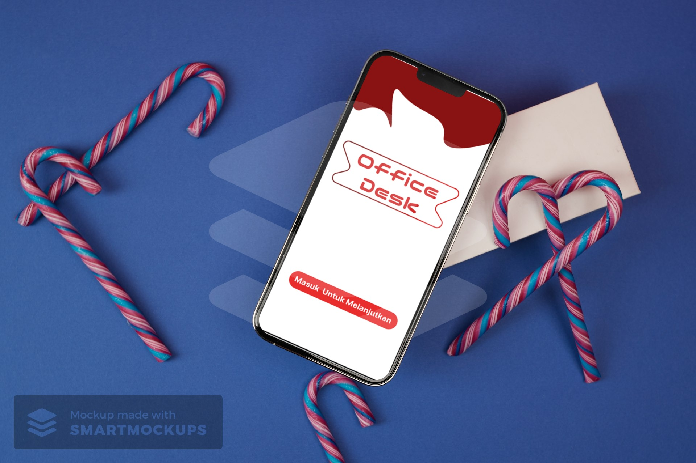
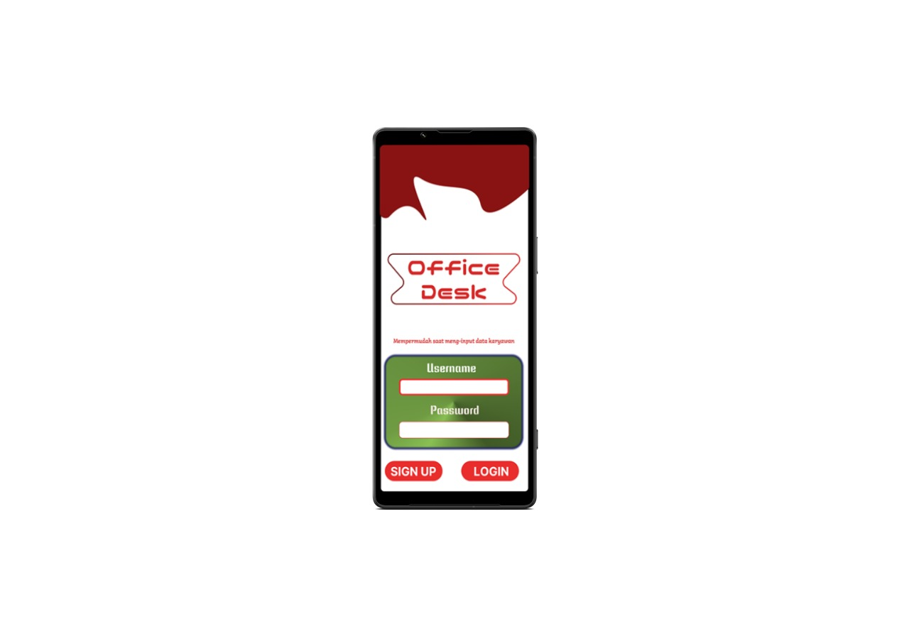
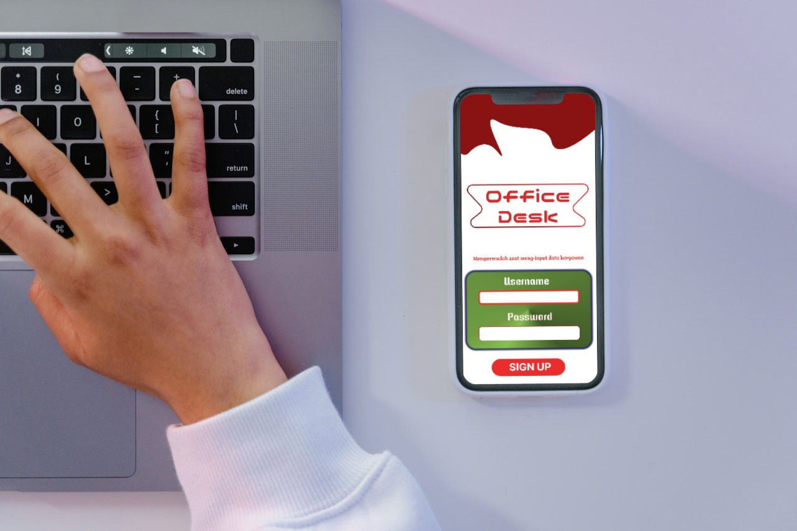
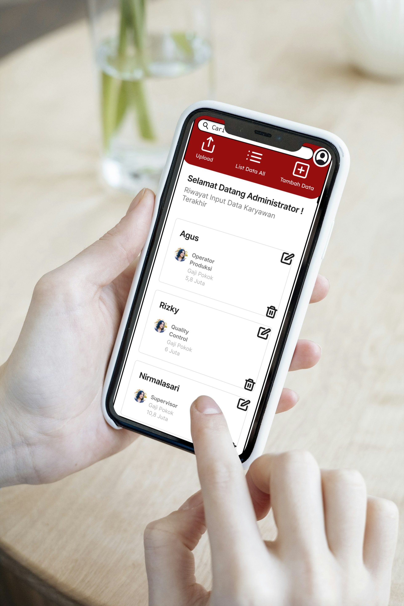
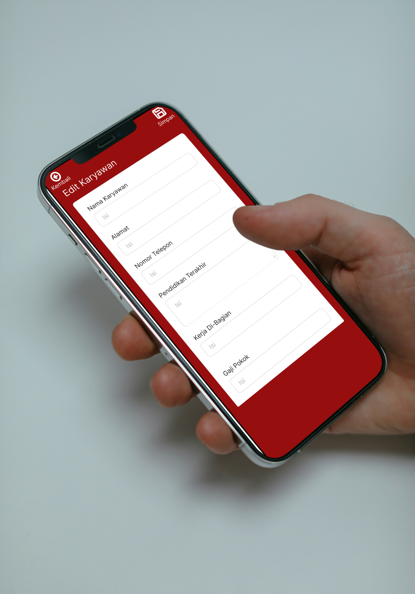
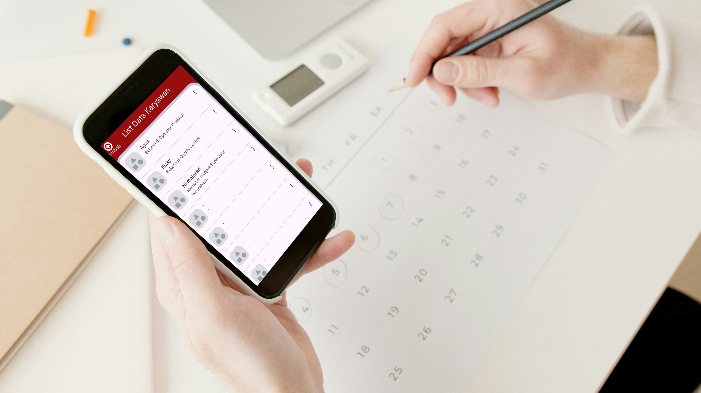
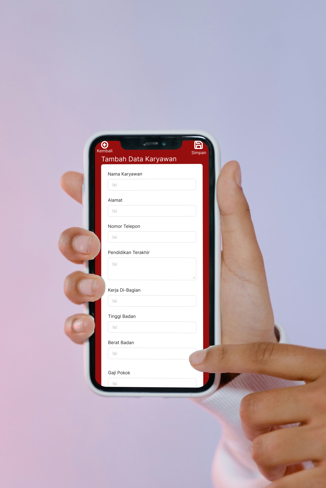
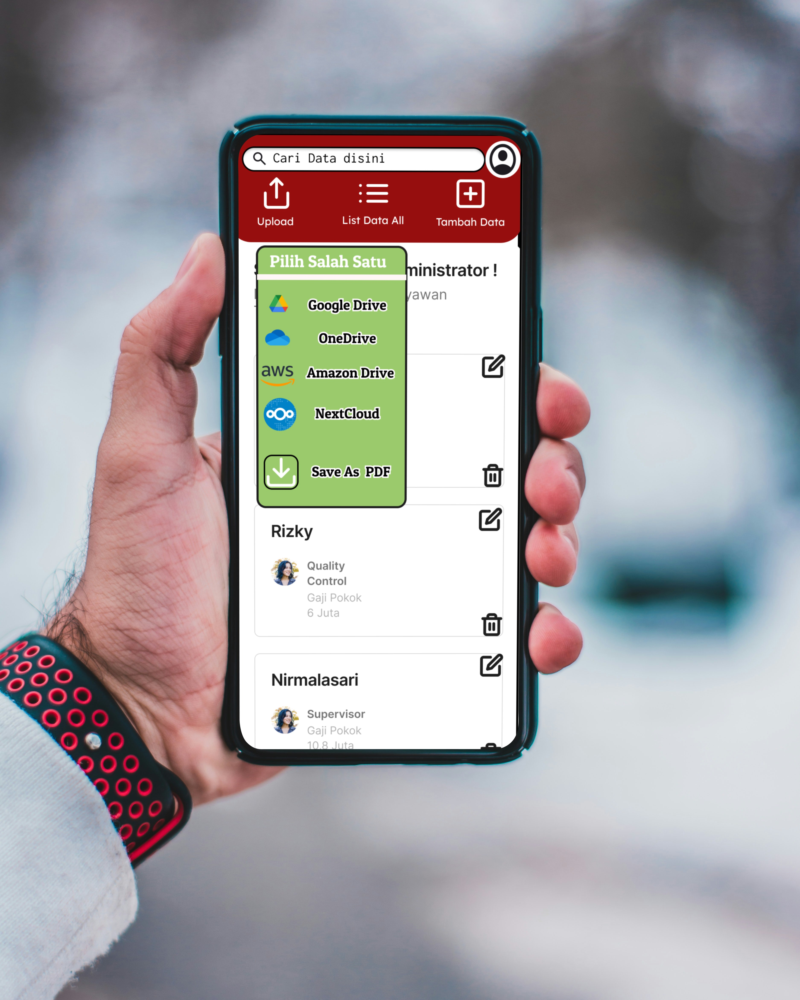
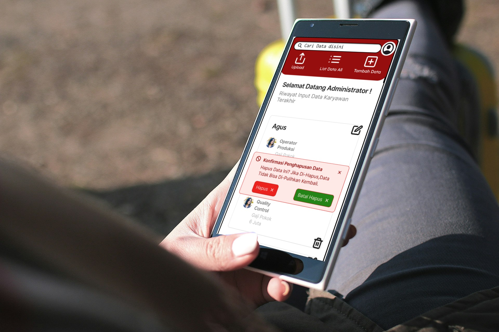

# OfficeDesk-Mobile Data Apps Management

Overview
OfficeDesk-Mobile is a comprehensive mobile application designed to streamline the process of employee data input and management. This application is tailored for administrative personnel who need an efficient and user-friendly tool to handle employee information on the go.
# Features
- User Registration and Login: Secure access with user authentication.

- Dashboard Overview: A clean and intuitive dashboard displaying key employee data metrics.

- Add New Employee: Easily add new employee records with all necessary details.

- Edit Employee Information: Update existing employee data efficiently.

- Delete Employee Records: Remove employee records with confirmation to prevent accidental deletions.

- Search and Filter: Quickly find employee information using powerful search and filter options.

- Data Upload: Upload bulk employee data seamlessly.
# Use Code
- Kotlin
- Java
- Gradle
# StoryBoard For OfficeDesk-Mobile Data Apps Management

## Mockup UI Design Apps Interface For OfficeDesk-Mobile Data Appa Management

# Initial View

# User Interface For Login

# User Interface Sign Up

# User Interface For Dashboard

# User Interface For Data Edit

# User Interface For Employee Data List

# User Interface For Add Data

# User Interface For Cloud Storage Or Save Upload

# User Interface For Delete Data Employee

